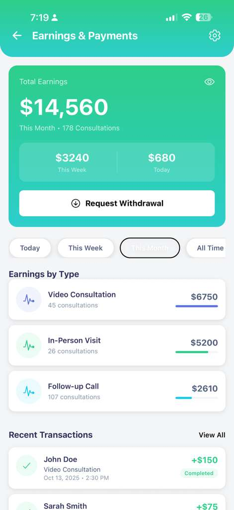

# TeleMedX - Comprehensive Telemedicine Platform

A modern, full-featured telemedicine platform with **both Web and Mobile applications**. Built with React/TypeScript (web) and React Native/Expo (mobile), this platform enables secure online consultations between doctors, nurses, and patients with integrated appointment scheduling, e-prescriptions, AI consultations, and comprehensive admin management.

## 🌟 Platform Overview

- **🖥️ Web Application** - React + TypeScript + Vite + TailwindCSS
- **📱 Mobile Application** - React Native + Expo SDK 54 + Argon Design
- **🔐 Auto-Detecting Login** - Smart routing based on user credentials
- **👥 Multi-Role Support** - Patient, Doctor, Nurse, Admin portals
- **🎨 Dynamic Theming** - 5 beautiful gradient themes (mobile)
- **🤖 AI-Powered** - LiveKit agents with Google Gemini
- **📹 Video Consultations** - Enterprise-grade WebRTC via LiveKit

## 🚀 Features

### 📱 Mobile App (React Native + Expo SDK 54)

#### Patient Portal (25+ Screens)
- 🏠 **Dashboard** - Clean overview with stats and quick actions
- 📅 **Appointments** - Smart scheduling with time-based join windows
  - Compact tabs: Upcoming & Past
  - Beautiful appointment cards with elegant join buttons
  - Add to Device Calendar integration
  - Can only join 15 min before to 30 min after scheduled time
  - Auto-routes to AI Chat or Video based on appointment type
- 💬 **Messages** - Full messaging system with conversations
  - Conversation list with unread badges
  - Individual chat screens with typing indicators
  - Support team live chat with quick actions
  - Camera & voice note support
  - Image sharing functionality
- 💊 **Prescriptions** - Medication management with refill requests
- 👤 **Profile** - Complete settings with 10+ sub-screens:
  - Personal Information (editable with photo upload)
  - Medical History (Conditions, Allergies, Surgeries, Family History)
  - Insurance Details (Primary & Secondary insurance cards)
  - Notifications Center (Categorized alerts with badges)
  - Payment Methods (Card management with scanning)
  - Privacy & Security (5 Theme options, data management)
  - Help & Support (Enhanced with FAQs, resources, WhatsApp)
- 📖 **Book Appointment** - 3-step booking process (Type, Date/Time, Confirm)
- 🤖 **AI Consultation** - LiveKit-powered voice assistant
- 📹 **Video Conference** - Full video call interface
- 🧪 **Lab Results** - Visit-based grouping with doctor notes
- 👨‍👩‍👧‍👦 **Family Management** ⭐ NEW
  - Link family members with account IDs
  - Switch profiles seamlessly
  - Book appointments on behalf of family
  - View family medical records
- 🎨 **Theme Selection** ⭐ NEW
  - 5 gradient themes (Violet, Green, Orange, Blue, Red)
  - Persistent across sessions
  - Applied to all screens

#### Doctor Portal (15+ Screens) ⭐ NEW
- 🏥 **Doctor Dashboard** - Command center with stats, tasks, alerts
- 👥 **Patient List** - Search, filter (All, Active, Critical, Recent)
- 📋 **Patient Records** - Full medical history with tabs
- 📅 **Appointments** - Doctor's appointment management
- 💊 **Prescriptions** - Review and manage all prescriptions
- ✍️ **Write Prescription** - Full prescription creation
- 🗓️ **Schedule** - Weekly timeline with appointment slots
- 🧪 **Lab Results Review** - Approve and annotate lab tests
- 📹 **Consultation Room** - Video interface for doctors
- 👤 **Profile** - Professional settings:
  - Personal Information (Education, Experience, Languages)
  - License & Credentials (Medical license, DEA, NPI, Insurance)
  - Availability Settings (Weekly schedule, blackout dates)
  - Earnings & Payments (Transaction history, payouts)

#### Nurse Portal (6 Screens) ⭐ NEW
- 🏥 **Nurse Dashboard** - Shift overview with urgent tasks
- 🩺 **Patient Monitoring** - Assigned patients with status
- 📊 **Vitals Recording** - Quick vital signs entry
- 💊 **Medication Tracking** - Due, Upcoming, Administered
- 📝 **Nursing Notes** - Clinical documentation
- 👤 **Nurse Profile** - Shift schedule and certifications

#### Shared Features
- 🔐 **Auto-Detecting Login** - Automatic role-based routing
- 🎨 **Dynamic Theming** - 5 beautiful gradient themes
- 🔔 **Notifications Center** - Categorized with badges
- 💳 **Card Scanning** - Front/back card scan for auto-fill
- 📸 **Camera Integration** - Photo upload throughout app
- 🎤 **Voice Notes** - Record and send audio messages
- 📅 **Calendar Integration** - Sync appointments to device
- 👨‍⚕️ **Multi-Role Support** - Patient, Doctor, Nurse, Admin

### For Patients (Web - 8 Screens)
- 📅 **Appointment Booking** - Browse doctors, select time slots, and pay securely online
- 🎥 **Video Consultations** - HD video calls with doctors via **LiveKit** (WebRTC)
- 🧠 **AI Symptom Checker** ⭐ NEW - AI-powered symptom analysis with automatic triage
- 📄 **E-Prescriptions** - Digital prescriptions with medication details
- 📊 **Prescription Tracking** ⭐ NEW - AI-powered medication adherence & reminders
- 📋 **Medical Records** - Complete health history with vitals, lab results, and consultations
- 🛒 **Pharmacy & Delivery** - Order medicines and track deliveries in real-time
- ⚙️ **Settings** - Profile, notifications, payment methods, and privacy settings (Horizontal Tabs)

### For Doctors (9 Screens)
- 🩺 **Doctor Dashboard** - Today's schedule, patient stats, and quick actions
- 🧠 **AI Triage Review** ⭐ NEW - Review AI-generated patient symptom assessments
- 📅 **Schedule Calendar** - Week/day/month views with appointment management
- 👥 **Patient Management** - Full patient list with search and contact info
- 📋 **Patient Records** - Comprehensive medical histories with tabbed navigation
- 💊 **Prescription Management** - View, edit, and track all prescriptions
- ✍️ **Prescription Writer** - Dynamic e-prescription creation with medication database
- 🎥 **Consultation History** - Past video consultations with detailed notes
- ⚙️ **Settings** - Profile, availability schedule, notifications, and payments (Horizontal Tabs)

### For Administrators (11 Screens)
- 📊 **Admin Dashboard** - Platform overview with key metrics and recent activity
- 👤 **User Management** - Full user list with search, filters, and bulk actions
- 🛡️ **Doctor Verification** ⭐ NEW - License verification & background checks
- 📈 **Analytics** - Revenue trends, top doctors, specialty distribution, and reports
- 💰 **Revenue Dashboard** ⭐ NEW - Financial analytics & transaction tracking
- 🚨 **AI Fraud Detection** ⭐ NEW - Detect fake doctors & suspicious activities
- 📝 **System Logs & Audit Trail** ⭐ NEW - HIPAA/GDPR compliant logging
- 🧠 **AI Reports & Heatmaps** ⭐ NEW - AI feature usage analytics
- 🔔 **Notification Management** ⭐ NEW - Push notification campaigns & templates
- 💻 **System Health** - Server monitoring, service status, performance metrics, and logs
- ⚙️ **Settings** - Email, payment, security, backup, API keys, and content management (Horizontal Tabs)

### Shared Features
- 🔐 **Role-Based Authentication** - Secure login for patients, doctors, and admins
- 🎥 **LiveKit Video Integration** ⭐ NEW - Enterprise-grade video consultations
- 🎤 **Voice Assistant** ⭐ NEW - Voice commands & medical dictation
- 🤸 **Pose Detection** ⭐ NEW - AI-powered movement analysis during video calls
- 📝 **Auto Note Generator** ⭐ NEW - AI-generated clinical SOAP notes for doctors
- 🎨 **Modern UI/UX** - Professional glassmorphism design with smooth animations
- 📱 **Mobile Responsive** - Works seamlessly on all devices
- 🔒 **HIPAA-Ready Architecture** - Healthcare data compliance structure
- 🌐 **Multi-Role Support** - 6 roles (Patient, Doctor, Pharmacist, Lab, Admin, Super Admin)
- ↔️ **Collapsible Sidebar** ⭐ NEW - Expand/collapse navigation menu
- ✨ **Premium Design** - Latest UI trends with gradients, shadows, and micro-interactions

## 🏗️ Technology Stack

### Web Application
- **Frontend**: React 18 with TypeScript
- **Build Tool**: Vite (blazing fast HMR)
- **Styling**: Tailwind CSS
- **UI Components**: Custom shadcn/ui components
- **Routing**: React Router v6
- **Icons**: Lucide React
- **Charts**: Recharts
- **Date Handling**: date-fns
- **Video**: LiveKit Client SDK
- **Type Safety**: Full TypeScript coverage

### Mobile Application
- **Framework**: React Native with Expo SDK 54
- **Navigation**: React Navigation v6 (Stack + Bottom Tabs)
- **UI Library**: React Native Paper (Material Design 3)
- **Theme**: Custom Argon Design System
- **Icons**: Expo Vector Icons (Ionicons)
- **State Management**: React Context API (Auth, Theme, Family)
- **Storage**: AsyncStorage (persistent data)
- **Camera**: expo-image-picker
- **Audio**: expo-av (voice notes)
- **Calendar**: expo-calendar
- **Video**: LiveKit React Native SDK
- **Utilities**: expo-file-system, expo-sharing, expo-print

### Backend & AI
- **Backend Server**: Node.js + Express
- **AI Agent**: Python + LiveKit Agents SDK
- **LLM**: Google Gemini
- **TTS**: Google Text-to-Speech
- **Video Infrastructure**: LiveKit Cloud
- **Token Generation**: LiveKit Server SDK

## 📁 Project Structure

```
telemedicine/
├── frontend/                      # React Web Application
│   ├── src/
│   │   ├── components/
│   │   │   ├── ui/                # Reusable UI components
│   │   │   ├── livekit/           # LiveKit-specific components
│   │   │   └── layout/            # Desktop layout components
│   │   ├── pages/
│   │   │   ├── patient/           # Patient portal
│   │   │   ├── doctor/            # Doctor portal
│   │   │   └── admin/             # Admin portal
│   │   ├── services/              # API & AI services
│   │   ├── hooks/                 # Custom React hooks
│   │   ├── lib/                   # Utilities
│   │   ├── App.tsx                # Main app with routing
│   │   ├── main.tsx               # Entry point
│   │   └── index.css              # Global styles
│   ├── public/                    # Static assets
│   ├── index.html
│   ├── package.json
│   ├── vite.config.ts
│   ├── tailwind.config.js
│   └── tsconfig.json
├── mobile/                        # React Native Mobile App (Expo SDK 54)
│   ├── src/
│   │   ├── screens/               # Mobile screens (50+ total)
│   │   │   ├── auth/              # Authentication (3 screens)
│   │   │   │   ├── LoginScreen.js
│   │   │   │   ├── SignupScreen.js
│   │   │   │   └── ForgotPasswordScreen.js
│   │   │   ├── patient/           # Patient Portal (25+ screens)
│   │   │   │   ├── DashboardScreen.js
│   │   │   │   ├── AppointmentsScreen.js
│   │   │   │   ├── MessagesScreen.js
│   │   │   │   ├── PrescriptionsScreen.js
│   │   │   │   ├── ProfileScreen.js
│   │   │   │   ├── [20 more screens...]
│   │   │   ├── doctor/            # Doctor Portal (15 screens)
│   │   │   │   ├── DoctorDashboard.js
│   │   │   │   ├── PatientListScreen.js
│   │   │   │   ├── PatientRecordScreen.js
│   │   │   │   ├── WritePrescriptionScreen.js
│   │   │   │   ├── [11 more screens...]
│   │   │   ├── nurse/             # Nurse Portal (6 screens)
│   │   │   │   ├── NurseDashboard.js
│   │   │   │   ├── PatientMonitoringScreen.js
│   │   │   │   ├── VitalsRecordingScreen.js
│   │   │   │   └── [3 more screens...]
│   │   │   └── chat/              # Chat Screens (3 screens)
│   │   ├── contexts/              # React Contexts
│   │   │   ├── AuthContext.js     # Auth & role management
│   │   │   ├── ThemeContext.js    # Theme selection
│   │   │   └── FamilyContext.js   # Family management
│   │   └── theme/                 # Argon Design System
│   ├── App.js                     # Main app with 3 role-based navigators
│   ├── app.json                   # Expo config
│   └── package.json
├── server/                        # Node.js Backend (Express)
│   ├── connection-details.js      # LiveKit token server
│   └── package.json
├── agent/                         # Python AI Agent
│   ├── agent.py                   # LiveKit AI agent
│   ├── instructions.py            # Agent instructions
│   ├── requirements.txt           # Python dependencies
│   ├── install.bat                # Install script
│   └── run.bat                    # Run script
├── START_SERVER.bat               # Start Node.js backend
├── START_AGENT.bat                # Start Python AI agent
└── README.md
```

## 🚀 Getting Started

### Prerequisites

- **Node.js 18+** (for web & mobile)
- **npm or yarn** 
- **Python 3.10+** (for AI agent)
- **Expo Go app** (optional, for testing on device)

### Quick Start

#### 🖥️ Web Application (Frontend)

**Option 1: Using Batch File (Windows)**
```bash
# Just double-click START_FRONTEND.bat (coming soon)
```

**Option 2: Manual**
```bash
cd frontend
npm install
npm run dev
```
**Access:** http://localhost:5173

**Demo Accounts:**
- Patient: `patient@test.com` / `test123`
- Doctor: `doctor@test.com` / `test123`
- Admin: `admin@test.com` / `test123`

---

#### 📱 Mobile Application (React Native + Expo)

**Start the mobile app:**
```bash
cd mobile
npm install
npx expo start
```

**Run on:**
- Press `w` for **Web preview**
- Scan QR code with **Expo Go** app (iOS/Android)
- Press `a` for **Android Emulator**
- Press `i` for **iOS Simulator**

**Demo Accounts:**
- Patient: `patient@test.com` / `test123`
- Doctor: `doctor@test.com` / `test123`
- Nurse: `nurse@test.com` / `test123`
- Admin: `admin@test.com` / `test123`

---

#### 🔧 Backend Services

**1. LiveKit Token Server (Required for AI/Video)**
```bash
cd server
npm install
npm start
```
**Running on:** http://localhost:3001

**2. Python AI Agent (Optional for AI consultations)**
```bash
cd agent
python -m pip install -r requirements.txt
python agent.py start
```

**Or use batch files (Windows):**
- `START_SERVER.bat` - Start Node.js backend
- `START_AGENT.bat` - Start Python AI agent

### Configuration

1. **Configure LiveKit for Video & AI Agent**
   ```bash
   cd frontend
   copy env.template .env
   
   # Edit .env and add your credentials:
   # VITE_LIVEKIT_URL=wss://your-project.livekit.cloud
   # VITE_LIVEKIT_API_KEY=your-api-key
   # VITE_LIVEKIT_API_SECRET=your-api-secret
   # VITE_GOOGLE_API_KEY=your-google-ai-key
   ```

2. **Configure Backend Server**
   ```bash
   cd server
   # Create .env with same LiveKit credentials
   ```

3. **Configure AI Agent**
   ```bash
   cd agent
   # Create .env with same LiveKit & Google credentials
   ```

### Demo Accounts

Use these credentials to explore different user roles:

**Patient Account:**
- Navigate to login → Select "Patient" role
- Explore: Dashboard, Book Appointments, Medical Records, Prescriptions, Pharmacy

**Doctor Account:**
- Navigate to login → Select "Doctor" role  
- Explore: Dashboard, Patient Records, Write Prescriptions, Video Consultations

**Admin Account:**
- Navigate to login → Select "Admin" role
- Explore: Analytics, User Management, System Configuration

## 🔧 Available Scripts

### Frontend (Web App)
```bash
cd frontend
npm run dev          # Start dev server with HMR
npm run build        # Build for production
npm run preview      # Preview production build
npm run lint         # Run ESLint
```

### Mobile App
```bash
cd mobile
npm run web          # Start web version
npm run android      # Start on Android
npm run ios          # Start on iOS
npm start            # Start with Expo Dev Tools
npm run clear        # Clear cache
```

### Backend Server
```bash
cd server
npm start            # Start token server
```

### AI Agent
```bash
cd agent
python agent.py start   # Start AI agent
```

## 🎯 Key Pages & Routes

### Authentication
- `/login` - User login
- `/register` - New user registration

### Patient Routes
- `/patient/dashboard` - Patient home
- `/patient/ai-symptom-checker` ⭐ NEW - AI symptom analysis & triage
- `/patient/book-appointment` - 3-step appointment booking
- `/patient/medical-records` - Complete health records
- `/patient/prescriptions` - E-prescription management
- `/patient/prescription-tracking` ⭐ NEW - Medication adherence tracking
- `/patient/pharmacy` - Medicine ordering & tracking
- `/patient/settings` - Profile and preferences

### Doctor Routes
- `/doctor/dashboard` - Doctor home with schedule
- `/doctor/ai-triage` ⭐ NEW - Review AI patient assessments
- `/doctor/calendar` - Weekly/monthly schedule calendar
- `/doctor/patients` - Patient list and management
- `/doctor/patient-record/:id` - Patient medical history
- `/doctor/prescriptions` - Prescription management
- `/doctor/write-prescription` - E-prescription creator
- `/doctor/consultations` - Consultation history
- `/doctor/settings` - Profile and preferences

### Admin Routes
- `/admin/dashboard` - Platform overview
- `/admin/users` - User management with advanced search
- `/admin/doctor-verification` ⭐ NEW - Doctor license verification workflow
- `/admin/analytics` - Reports and business intelligence
- `/admin/revenue` ⭐ NEW - Revenue & transaction dashboard
- `/admin/fraud-detection` ⭐ NEW - AI fraud detection system
- `/admin/system-logs` ⭐ NEW - Audit trail & access logs
- `/admin/ai-reports` ⭐ NEW - AI usage analytics & heatmaps
- `/admin/notifications` ⭐ NEW - Push notification management
- `/admin/system-health` - System monitoring and logs
- `/admin/settings` - Platform configuration

### Shared Routes
- `/video-call` - Video consultation interface (LiveKit-powered)
  - Query params: `?room=<roomName>&name=<userName>&role=<patient|doctor>`

## 📚 Architecture Overview

**Project Organization:**
```
telemedicine/
├── frontend/            # React + Vite web application
│   └── src/
│       ├── components/  # UI components
│       ├── pages/       # Route pages
│       ├── services/    # API & AI services
│       └── hooks/       # Custom hooks
├── mobile/              # React Native + Expo mobile app
│   └── src/
│       ├── screens/     # Mobile screens
│       └── theme/       # Argon theme
├── server/              # Node.js + Express backend
│   └── connection-details.js  # LiveKit token API
└── agent/               # Python AI agent
    └── agent.py         # LiveKit agent with Google AI
```

**Layout System:**
- Uses `DesktopLayout` wrapper for desktop (≥1024px)
- Direct rendering for mobile/tablet
- Automatic responsive switching
- Role-based theming

**API Integration Points:**
- Authentication endpoints ready
- Patient/Doctor/Admin API structure
- WebRTC signaling architecture
- Payment gateway integration ready

**Database Recommendations:**
- Users, Doctors, Patients tables
- Appointments with scheduling
- Prescriptions and medications
- Medical records (EHR)
- Orders and pharmacy tracking

## 🔐 Security Features

- Role-based access control (RBAC)
- Secure authentication flow
- HIPAA-compliance ready architecture
- End-to-end encryption indicators
- Protected routes
- Input validation
- XSS protection ready

## 🎨 UI/UX Highlights

### Web Application
- **Professional Desktop Layout**: Sidebar navigation with collapsible menu
- **Glassmorphism Design**: Modern frosted glass effects with gradient accents
- **Smooth Animations**: Fade-in, slide-up, and hover lift effects
- **Responsive Design**: Automatically adapts to desktop/tablet/mobile
- **Data Tables**: Sortable, filterable patient and appointment lists
- **Multi-Column Grids**: 12-column system for complex layouts
- **Color-Coded Roles**: 
  - Blue/Cyan gradients for patients
  - Teal/Emerald gradients for doctors
  - Amber/Orange gradients for admins

### Mobile Application (React Native)
- **Native Performance**: True mobile app with 60fps animations
- **Argon Design System**: Professional gradient themes throughout
- **Bottom Tab Navigation**: Intuitive 5-tab layout per role
- **Dynamic Theming**: 5 customizable gradient options
  - Violet (default), Green, Orange, Blue, Red
  - Persistent theme selection
- **Touch-Optimized**: Perfect tap targets and gesture support
- **Compact Tabs**: Space-efficient with badges
- **Beautiful Cards**: Elevated shadows and rounded corners
- **Smart Components**: Auto-adjusting based on content
- **Role-Based UI**: Different designs for Patient/Doctor/Nurse
- **Smooth Transitions**: Native animations between screens
- **Professional Polish**: Enterprise-ready mobile experience

## 📱 Platform Comparison

| Feature | Web App | Mobile App |
|---------|---------|------------|
| **Login** | Role selector removed | Auto-detecting ✅ |
| **Navigation** | Sidebar + Top bar | Bottom tabs + Stack |
| **Theming** | Fixed gradients | 5 themes ✅ |
| **Offline** | Limited | Coming soon |
| **Push Notifications** | Browser only | Native ✅ |
| **Camera/Voice** | Web APIs | Native ✅ |
| **Calendar Sync** | Download only | Device calendar ✅ |
| **Performance** | Web-based | Native 60fps ✅ |
| **Family Mgmt** | Not yet | Full featured ✅ |
| **Card Scan** | Manual entry | Camera scan ✅ |

## 🚀 Deployment

### Web Application Deployment

**Vercel (Recommended)**
```bash
cd frontend
npm run build
vercel --prod
```

**Netlify**
```bash
cd frontend
npm run build
# Deploy 'dist' folder to Netlify
```

**Custom Server**
```bash
cd frontend
npm run build
# Serve 'dist' folder with nginx or any web server
```

---

### Mobile Application Deployment

**Build for Production:**

**Android (APK/AAB)**
```bash
cd mobile
eas build --platform android
```

**iOS (IPA)**
```bash
cd mobile
eas build --platform ios
```

**Over-the-Air Updates**
```bash
cd mobile
eas update --branch production
```

**Publish to Stores:**
- **Google Play**: Use EAS Submit
- **Apple App Store**: Use EAS Submit
- See [Expo documentation](https://docs.expo.dev/submit/introduction/)

---

### Backend Requirements

For production deployment:
- **API Server**: Node.js/Express (already included in `server/`)
- **Database**: PostgreSQL for user/appointment data
- **Cache**: Redis for sessions
- **Storage**: AWS S3 for files (prescriptions, documents, photos)
- **Video**: LiveKit Cloud (managed service)
- **AI Agent**: Deploy Python agent with LiveKit Agents SDK

## ✅ Implemented Features

### Web Application
- [x] **LiveKit Video Integration** - Real-time video consultations
- [x] **AI Symptom Checker** - Intelligent symptom triage
- [x] **Prescription Tracking** - Medication adherence monitoring
- [x] **Voice Assistant** - Speech recognition & medical dictation
- [x] **Pose Detection** - Movement analysis during video calls
- [x] **Auto Note Generator** - AI-generated clinical notes
- [x] **Multi-Role Management** - Patient, Doctor, Admin portals
- [x] **Doctor Verification** - License & background checks
- [x] **Fraud Detection** - AI-powered security monitoring
- [x] **System Audit Logs** - HIPAA/GDPR compliance
- [x] **Analytics Dashboard** - AI usage & revenue reports
- [x] **Collapsible Sidebar** - Expandable navigation menu
- [x] **Auto-Detecting Login** - Automatic role-based routing

### Mobile Application
- [x] **React Native + Expo SDK 54** - Native mobile app
- [x] **Patient Portal** - 25+ screens with full functionality
- [x] **Doctor Portal** - 15+ professional screens
- [x] **Nurse Portal** - 6 screens for nursing workflows
- [x] **Family Management** - Link and manage family members
- [x] **Dynamic Theming** - 5 gradient theme options
- [x] **Auto-Detecting Login** - Smart credential-based routing
- [x] **Calendar Integration** - Native device calendar sync
- [x] **Camera Integration** - Photo upload and card scanning
- [x] **Voice Notes** - Audio recording and playback
- [x] **Push Notifications** - Native notification center
- [x] **Messaging System** - Chat with doctors and support
- [x] **Lab Results** - Visit-based grouping with sharing
- [x] **Payment Management** - Card scanning and storage
- [x] **Profile Switching** - Family member profile management
- [x] **LiveKit Integration** - AI and video consultations

## 📸 Screenshots

### 🖥️ Desktop Application

<div align="center">

#### Login & Authentication

*Modern login with automatic role detection*

#### Patient Dashboard

*Clean patient dashboard with quick stats and appointments*

#### Doctor Dashboard

*Professional doctor interface with patient management*

#### Appointment Booking

*Seamless appointment scheduling system*

#### AI Consultation

*LiveKit-powered AI health assistant*

#### Video Consultation

*HD video consultations with doctors*

#### Medical Records

*Comprehensive health history tracking*

#### Prescriptions

*Digital prescription management*

#### Admin Dashboard

*Advanced admin controls and analytics*

#### System Health

*Real-time system monitoring*

</div>

### 📱 Mobile Application (React Native + Expo)

<div align="center">

#### Authentication Flow
  

*Auto-detecting login • Patient signup • Password recovery*

#### Patient Dashboard & Navigation
  

*Clean dashboard • Smart appointments • Messaging system*

#### Booking & Consultations
  

*3-step booking • AI consultation • Video conference*

#### Profile & Settings
  

*Profile menu • Editable info • Medical history*

#### Insurance & Payments
  

*Insurance cards • Payment methods • Card scanning*

#### Notifications & Security
  

*Notification center • Theme selection • Help & support*

#### Lab Results & Family
  

*Lab results by visit • Family management • Add member*

#### Doctor & Nurse Portals
  

*Doctor dashboard • Patient list • Prescription management*

</div>

---

## 🔮 Future Roadmap

- [x] Progressive Web App (PWA) with offline support
- [x] Mobile apps (React Native + Expo) ✅
- [ ] Real backend API integration
- [ ] Payment gateway integration (Stripe/PayPal)
- [ ] Wearable device integration
- [ ] Multi-language support
- [ ] Insurance integration
- [ ] Electronic Health Records (EHR) export
- [ ] HL7/FHIR standard compliance

## 🤝 Contributing

Contributions are welcome! The architecture is modular and extensible:

1. Create new page components in appropriate directories
2. Add routes in `App.tsx`
3. Build reusable UI components in `components/ui/`
4. Follow established patterns for consistency

## 📄 License

MIT License - Feel free to use this for your telemedicine projects.

## 🙏 Acknowledgments

- Built with [React](https://react.dev/)
- UI components inspired by [shadcn/ui](https://ui.shadcn.com/)
- Icons by [Lucide](https://lucide.dev/)
- Styled with [Tailwind CSS](https://tailwindcss.com/)

## 📞 Support

For questions, issues, or feature requests, please open an issue on the repository.

---

**Built with ❤️ for modern healthcare**

